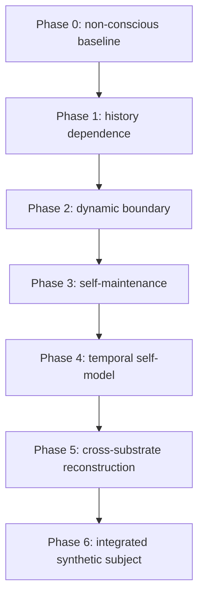

# Soul Structure Theory / Consciousness-AI Operations v1

## Purpose and scope

This document turns DIBT into one bounded workstream inside a falsification-first research program. It does **not** define a consciousness detector or establish consciousness, qualia, a soul, or substrate-independent identity.

The program asks a narrower engineering question:

> Can an artificial dynamical system show preregistered, reproducible functional properties of history dependence, boundary reconstruction, self-maintenance, and self-model-based control that capacity-matched simpler systems do not explain?

The operating rule is: **build upward only after falsifying downward**.

## Claim firewall

| Level | Permitted claim | Current status |
|---|---|---|
| L0 | A statistical structure was observed. | In scope |
| L1 | History or interventions improved a preregistered prediction/recovery endpoint. | Conditional, synthetic only |
| L2 | A specified intervention supports a causal dependency in the stated generator. | Conditional, synthetic only |
| L3 | A specified mediator/boundary mechanism is supported against named alternatives. | Not established |
| L4 | A dynamic boundary is regenerated under the registered operational definition. | Not established |
| L5 | Consciousness, qualia, subjectivity | Unverified; no inference allowed |
| L6 | Soul, identity persistence, metaphysical individuality | Non-identifiable from this program |

Forbidden inferences include: prediction gain -> consciousness; memory -> self; self-model -> subjective experience; response similarity -> identity; cross-substrate reconstruction -> soul transfer.

## DIBT inventory

| Component | Evidence status | What it supports | What it does not support |
|---|---|---|---|
| Phase 0 on `main` | Implemented synthetic scaffold | Testable boundary-edge recovery protocol | Any claim about biological or artificial consciousness |
| Phase 0-r1, PR #1 | Open, mergeable, frozen OOD result | DIBT reference estimator can be compared with CMI-only under registered synthetic OOD interventions and a common-driver control | General boundary inference or estimator integration value |
| CMI and DO reference estimator | Implemented in PR #1 | A conservative reference combination can be tested | A uniquely correct DIBT estimator |
| Boundary-removal/regeneration extension | Secondary mechanistic diagnostic | Synthetic damage/repair behavior | Regeneration of self, consciousness, or identity |
| Self-reference reports | External research evidence; not a repository gate | Limits on universal, complete, self-inclusive identification under restricted access | A positive consciousness criterion |
| CCSRA / IAT / PH / ATCT / CORENO | Related tracks, not evidence imported into DIBT | Candidate future dependencies | Substitution for DIBT-specific controls |

**Evidence integrity.** PR #1 must remain distinguished from `main` until merged. Results not committed as versioned repository artifacts are not treated as independently reproducible evidence by this ledger.

## Program dependency graph

Every arrow requires a frozen decision note. Passing a lower phase permits a narrower next test; it does not validate a higher-level claim.

## Current research state

- **Highest supported claim:** under the preregistered synthetic generator and the held-out intervention regime in Phase 0-r1, the reference estimator may be reported only as a conditional L0/L1 operational result once the frozen artifacts and implementation are available for audit.
- **Critical unknown:** whether the CMI-and-DO integration contributes anything beyond DO-only. The Phase 0-r1 research record reports that both DO-only and DIBT reached a ceiling result, so the primary improvement over CMI-only is not evidence of integration value.
- **Decision:** do not proceed to dynamic-agent or consciousness language based on the r1 outcome. Run one narrow, ceiling-avoiding estimator test first.

## Next minimal falsification: Phase 0-r2

### Proposition

**H2-r2:** In preregistered synthetic open-system generator families with incomplete or noisy intervention access, a blind CMI-and-DO estimator recovers boundary-candidate edges more accurately than a capacity-matched DO-only estimator on held-out intervention regimes.

This is an estimator-integration claim, not a claim about individual existence or consciousness.

### Design

- **Primary metric:** seed-level `delta_MCC_DO = MCC_integrated - MCC_DO_only`, measured on the evaluation-only true boundary-edge mask.
- **Baseline:** DO-only using the same transition data, intervention labels, and capacity budget as the integrated estimator.
- **Estimator blinding:** the generator partition, true edge mask, and generator-family label are unavailable to both estimators, threshold fitting, and model selection; they are revealed only in scoring.
- **Generator families:** preregister at least three family labels before execution: clean-intervention ceiling control, partial-coverage intervention, and intervention-amplitude noise. Family-specific parameters and allocation must be frozen before any OOD score is viewed.
- **OOD:** hold out both intervention amplitudes and one generator-family parameter regime. Report amplitude-stratified results without selecting the winning stratum.
- **Seed design:** at least 30 paired seeds per family; bootstrap only over seeds after the complete run is frozen.

### Primary falsification

**ORACLE-DO control:** give a DO-only oracle the same admissible intervention information and matched computational capacity. If the integrated estimator does not exceed this control with the frozen decision rule, conclude that Phase 0 supplies no evidence of integration value.

### Registered gates

1. all implementation, leakage, seed-reproducibility, and truth-blinding audits pass;
2. mean `delta_MCC_DO > 0`;
3. paired seed-bootstrap 95% CI lower bound is greater than 0;
4. the advantage is positive in the predeclared incomplete/noisy-intervention families and does not arise only from the clean ceiling control;
5. the common-driver boundary false-positive gate remains within its preregistered limit.

A failure of any gate gives `NOT_SUPPORTED_INTEGRATION_VALUE`; it does not invalidate the narrower r1 CMI-only comparison.

## Operating cadence

1. Inventory repository state, frozen artifacts, failed tests, and claim level.
2. Select exactly one bottleneck proposition.
3. Freeze metric, baseline, falsification, seeds, OOD split, and stop rule.
4. Implement tests before running the confirmatory configuration.
5. Record every gate outcome, including STOP results, in the Decision Ledger.
6. Escalate for user approval only to change a primary metric, success rule, central proposition, revive a stopped hypothesis, begin a new major track, or publish/raise an L5/L6 claim.

## Required Phase 0-r2 deliverables

- preregistration configuration and schema validation;
- blind estimator interface and truth-access audit;
- capacity-matched DO-only oracle;
- reproducible 30-seed-per-family runner;
- frozen summary, per-seed table, and Decision Note;
- updated `docs/decision_ledger.json`.

